# Passing-Input-Variables
This describes how to pass input variables in Terraform

There are 5 techniques to pass input variables in Terraform

1. Using Default Values with Variable Blocks in "variables.tf" file.

By assigning default values directly within our variable blocks, we ensure that Terraform uses these values if no alternative is provided.

For example, consider the following configuration that creates a local file resource and a random pet resource:

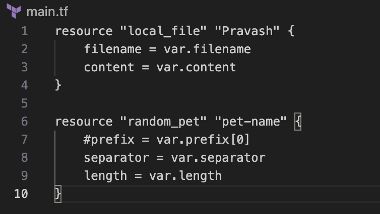

The variables.tf contains the default values in each Variable Blocks.

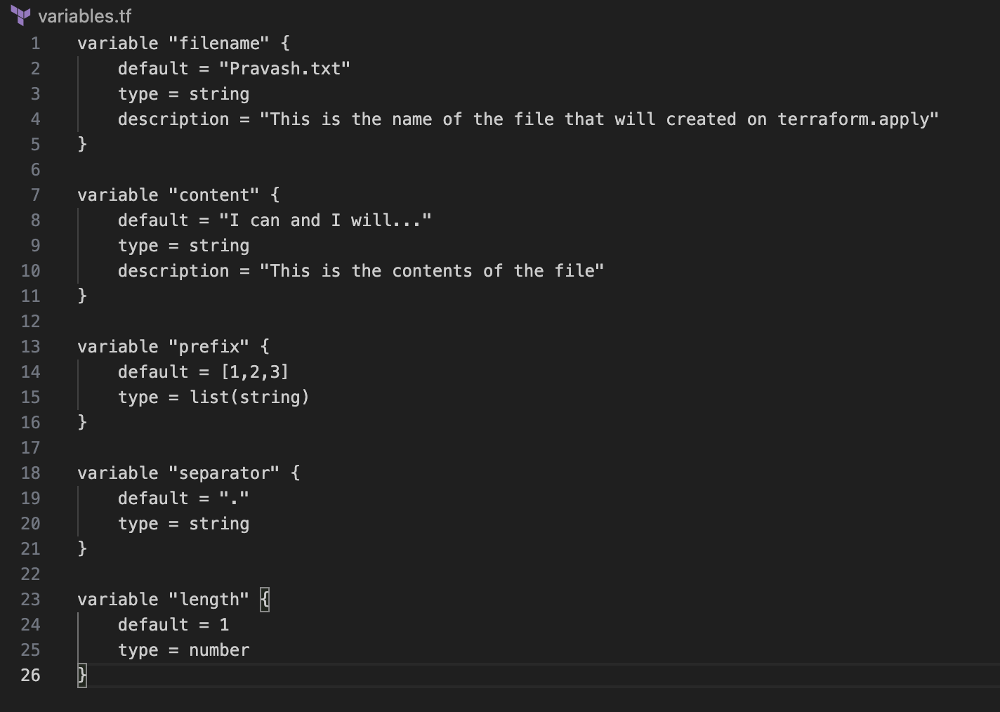

In this example, each variable has a default value. This way, Terraform has a backup plan when you don’t specify anything, making your configurations super reliable. It means, it is automatically used when no other input is provided.
However, it is not recommended for secrets or environment-specific values.

2. Providing Variable Values Interactively and via the Command Line.

Now, Let's consider the same example but this time there are no default values in the variable.tf file.

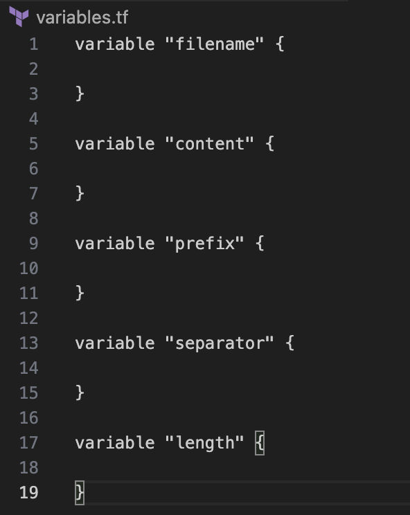

Now, if we do a "terraform apply", it will prompt us to fill all the values one by one.

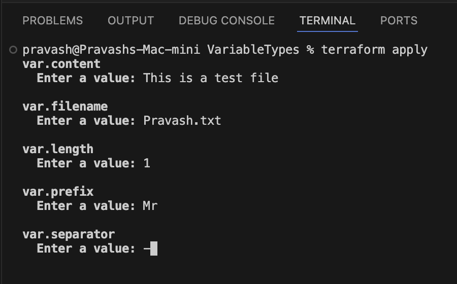

To avoid interactive prompts, we can pass values using the "-var" flag. We can supply multiple "-var" flags as needed:

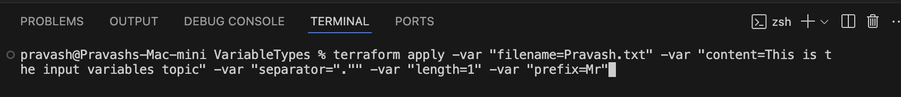

This is good for quick tests or scripting and works well for one or two variables. However, not ideal for sensitive data or large configs.

3. Environment Variables.

Another way we can provide values to the variables is by setting Environmental Variables. We can prefix the variable name with 'TF_VARS_'
For the same example:

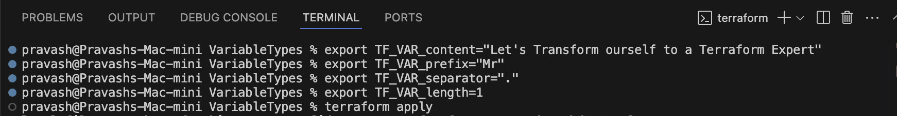

This is useful for Automation, CI/CD pipelines (e.g., GitHub Actions, Jenkins). Also, it is secure for sensitive values.

4. Using Variable Definition Files. This is useful when dealing with a lot of variables.

These files can be named anything but should end with either .tfvars or .tfvars.json.
For example, let's create a terraform.tfvars file with the following contents:

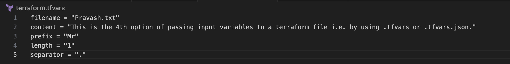

Now, a 'terraform apply' will load these values to the file.

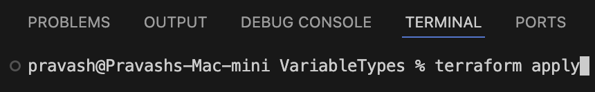

NOTE: Terraform automatically loads files if they are named:

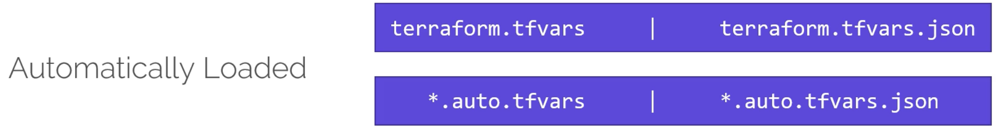

However, if the filename is a differently named file like 'variables.tfvars', be sure to specify it explicitly with the -var-file flag:

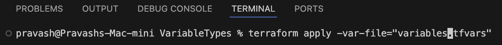

Typically this Option is not recommended when storing secrets or environment-specific values.

5. Terraform Cloud/Enterprise Workspace Variables.

Usage:
- Go to the Terraform Cloud/Enterprise UI
- Navigate to Workspace > Variables
- Add them as "Terraform Variable" or "Environment Variable"

NOTES:
- Useful for secure and shared environments.
- Great for teams using Terraform Cloud.

----------------------------------------------------------------------------------------------------
Order of Precedence

Now, we know that Terraform allows us to set variable values from multiple sources. However, When the same variable is defined in multiple places, Terraform follows a strict Order of Precedence to assign values to the variables.

Let's take an example.
We've a main.tf configuration file with a single resource.

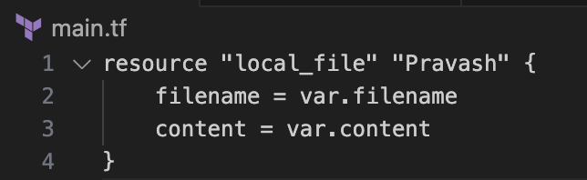

The above will create a local file based on the variable filename in the local folder.
In the variables.tf file, we have not declared the default for this variable.

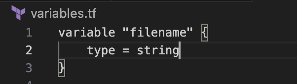

However, we have assigned different values to this variable in Multiple ways:

1. Environment Variable:

$ export TF_VAR_filename="/pravash.txt"

2. terraform.tfvars File:

filename = "/Pro.txt"

3. File Ending with .auto.tfvars:

filename = "/Liza.txt"

4. Command-Line Flag:

$ terraform apply -var "filename=/Pravash-Behera.txt"

The Question is Which one of the values will be accepted?
Terraform follows a Variable Definition Precedence to determine this.

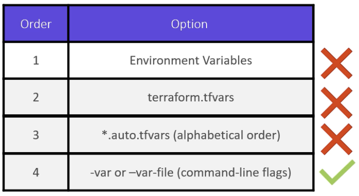

----------------------------------------------------------------------------------------------------
Prepared by: Pravash Behera
Last updated: April 2025
