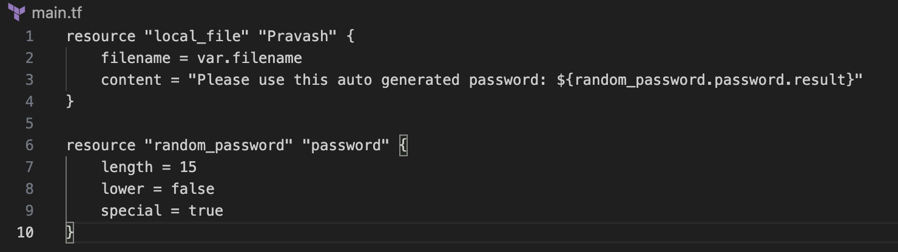
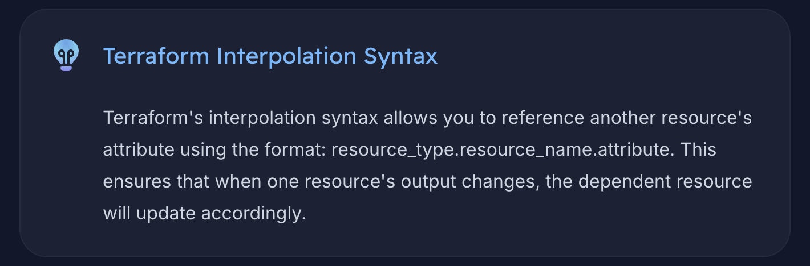
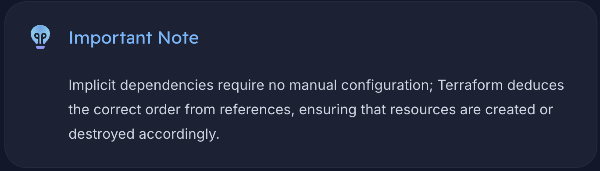
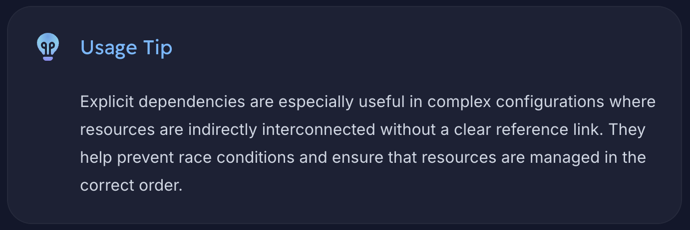

In the Real World Infrastructure provisioning process, it's rarely going to happen that there will not be any dependencies between two resources.

There are bound to be multiple resources that are going to be dependent on each other.

So, We'll make the Output of one resource as the Input of another one.

How to Link two resources together?

GOAL: We want the content of one file to have the password generated by another resource.

Let's create 2 resources in the 'main.tf' configuration file.

The resource random (https://registry.terraform.io/providers/hashicorp/random/latest/docs/resources/password) generates a 'result' which as per the document from Hashicorp, is a Read-only sensitive string.

Now, In order to show the value in the local_file resource, we're going to call the output of the random_password resource into a text file generated by the local_file resource 'Pravash'

The interpolation sequence (${...}) converts the evaluated expression into a string and dynamically inserts the password into the file content.

====================================================================================================
RESOURCE DEPENDENCIES

Implicit Dependency: (Reference Expression)
Terraform automatically detects implicit dependencies through reference expressions. For example, when we pass the output of one resource (like a random password) to another resource (such as a local file), Terraform understands that the random password must be created before the local file. Similarly, during deletion, Terraform removes the resources in reverse order to maintain consistency. (First local file then random password)

Explicit Dependency: (depends_on)
In some scenarios, a resource might indirectly rely on another resource without any direct reference. In these cases, we can explicitly specify the dependency using the depends_on argument. This method ensures that Terraform provisions and destroys resources in the intended order.

