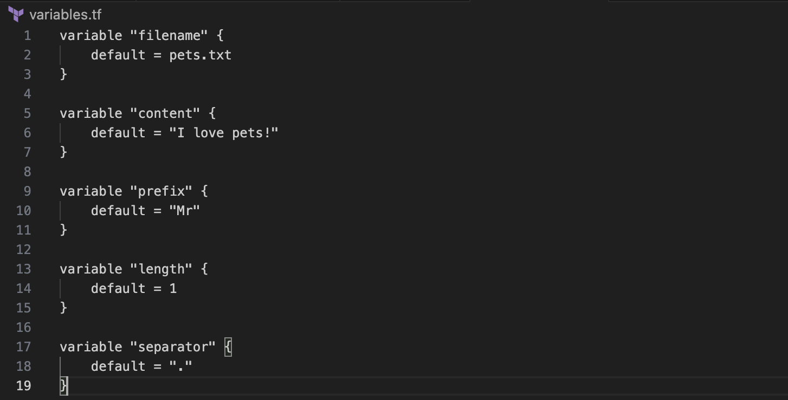

**Terraform Output** variables are a powerful tool which allows us to store the results of expressions from the configuration file for later use.

The syntax is:

**NOTE:** The value argument is Mandatory and is a reference expression. While we can add the optional argument 'description'.

Now, let's consider an example.
Let's create a configuration file 'main.tf' that creates a random pet name and an output variable that captures the generated id.

We'll also have a variables.tf file that declares the variables used in the main.tf file.

When we run a 'terraform apply' command, it prints the output variable in the screen.

Now, if we want to see the value of the output variables at a later stage, we can use the command:
'terraform output'

Additionally, if we want to print the value of the existing output variable, we can use the command:
'terraform output pet-name'

