TERRAFORM STATE

We'll understand how Terraform tracks real world infrastructure changes.

Terraform keeps track of this mapping in a state file, which acts as a blueprint for all the resources it manages. Whether it’s a local file, a random name for a pet resource, or a cloud resource. Every resource has a unique identity and metadata (including dependencies) recorded in this file. This record is super important for generating accurate execution plans when there’s a difference between your configuration and the actual state.

Let's take an example of a local directory 'terraform-local-file'.
Inside the directory, we've two files:
1. main.tf
2. variables.tf
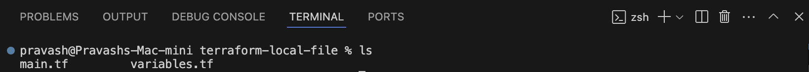

The primary terraform configuration is mentioned in the 'main.tf' file

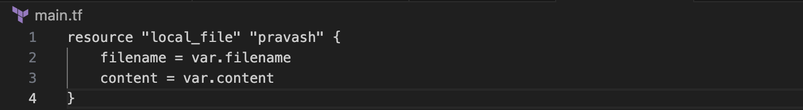

The Variables used by this main configuration file are in the 'variables.tf' file

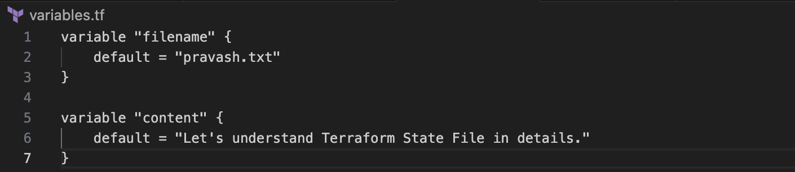

At this stage, no local file resource has been created yet.

Initializing and Running Terraform Plan

Before any resources are created or provisioned, we need to download the necessary plugins required for this terraform configuration file to do what it is required for.

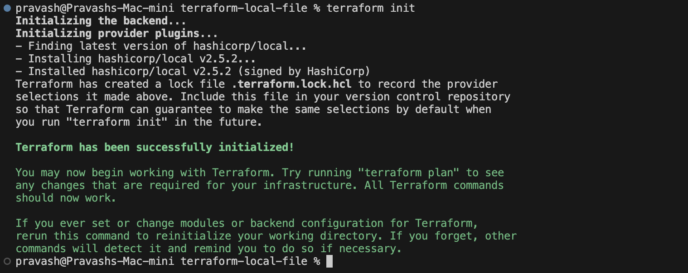

Now, let’s create an execution plan using the 'terraform plan' command. When we run it for the fist time, Terraform will generate a plan for what resources we need to create.
Since the state file does not yet record any resources, Terraform understands that all resources defined in the configuration will be newly created.

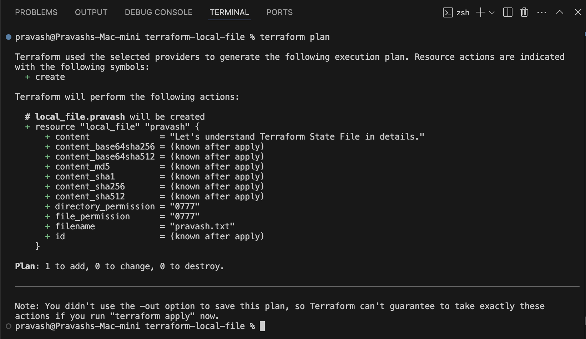

After this, let's say we ran the 'terraform apply' command and the resources get created.

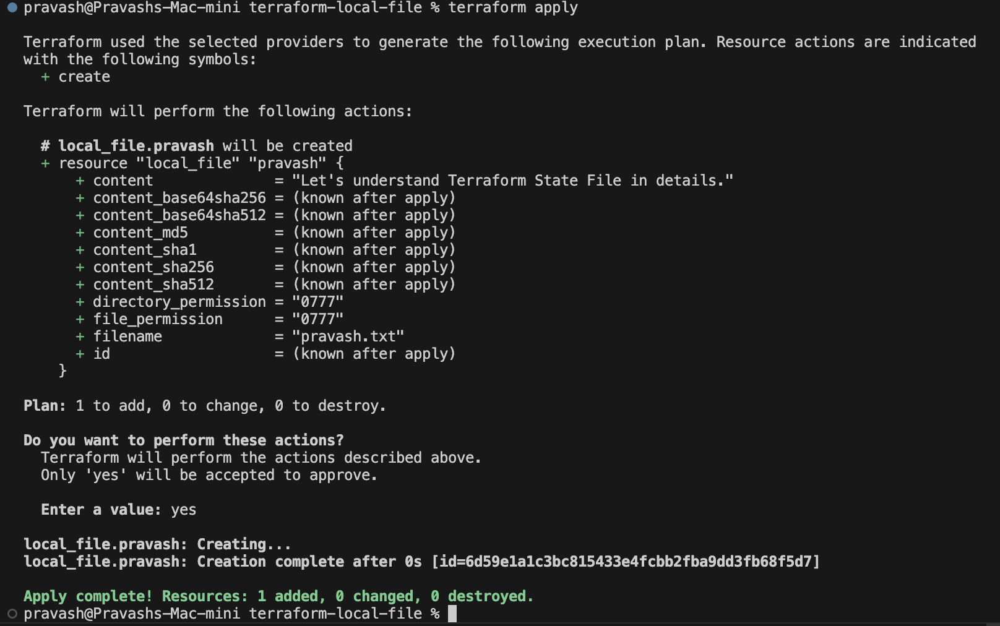

If you run terraform apply again, Terraform refreshes the state, detects that the resource already exists, and confirms that no further actions are needed:

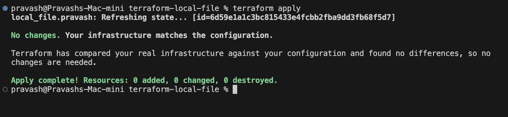

Terraform maintains a state file, which is how it tracks that the resource is already provisioned.

Terraform State File

After the initial successful terraform apply, an additional file named terraform.tfstate is created in the project directory. This file is a JSON data structure mapping your real-world infrastructure to the resource definitions from your configuration files. The directory now appears as follows:

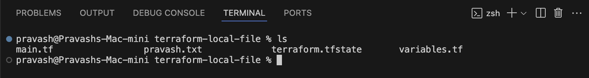

Now, if we inspect the state file, it will look like this. It reveals a detailed record of the infrastructure, including Resouce IDs, provider information, and resource attributes:

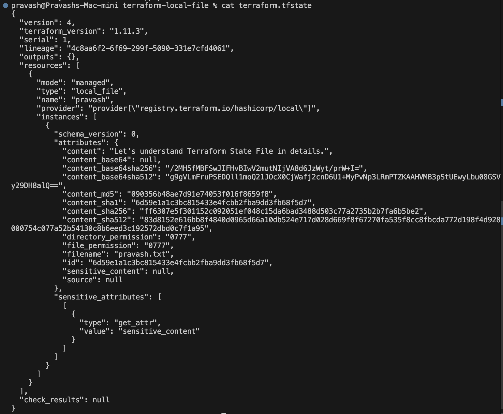

This state file is the single source of truth for Terraform.
It is leveraged during subsequent commands such as terraform plan and terraform apply to determine if any changes to the infrastructure are required.

Updating the Configuration
Now, let's update the configuration in variables.tf to modify the content of the file, as shown below:

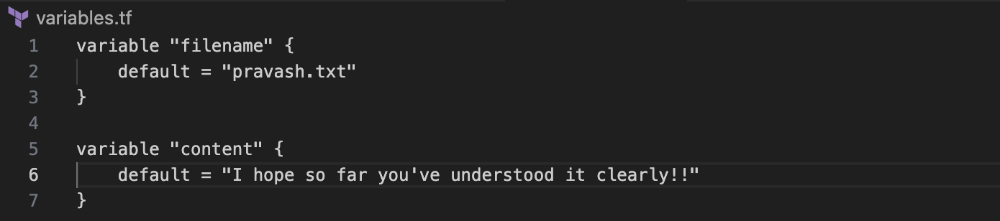

After this change, running terraform apply causes Terraform to refresh the state and detect a difference between the new configuration and the existing state. Consequently, Terraform decides the resource must be replaced:

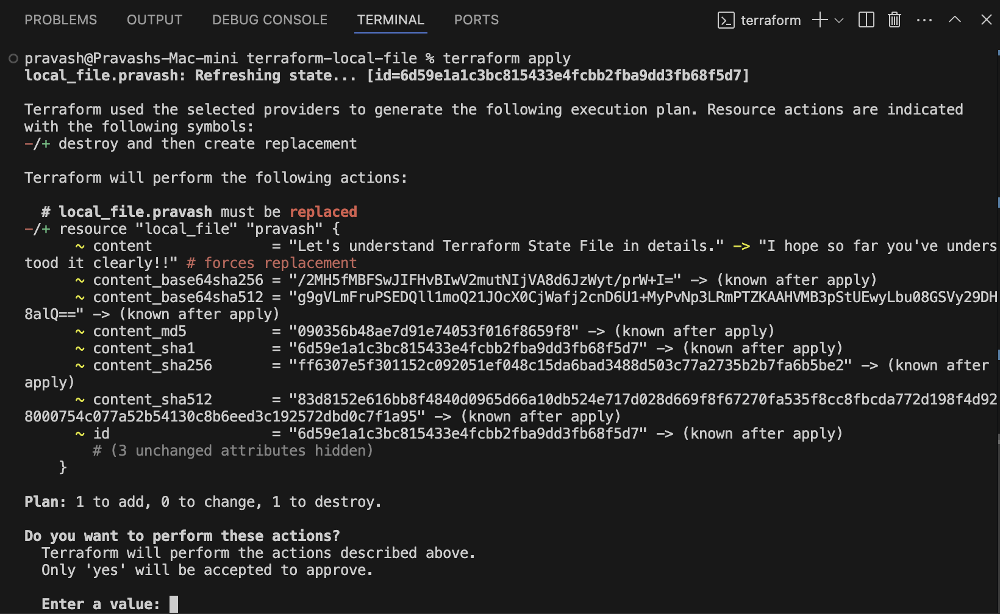

After applying these changes, Terraform deletes the old resource and creates a new one with a different unique ID. The updated terraform.tfstate now reflects the new state:

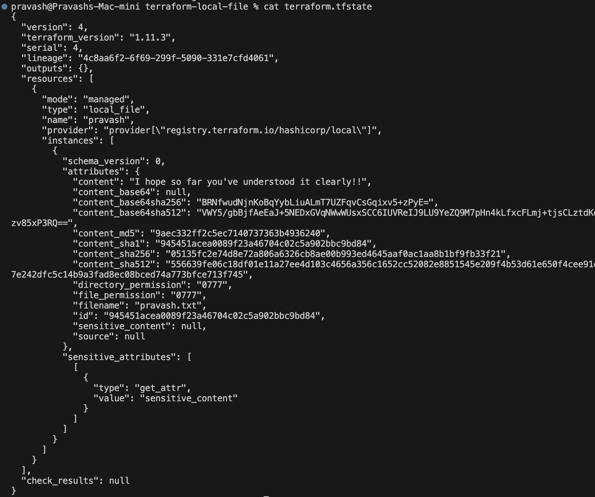

Now that the configuration file and the state file are in sync, any subsequent runs of terraform apply will report that no changes are necessary.

Conclusion

In this lesson, we explored how Terraform leverages a state file—initially created during the first successful apply—to track and manage real-world infrastructure. This state file serves as the authoritative record for your resources and is essential for Terraform to efficiently plan and apply configuration changes.

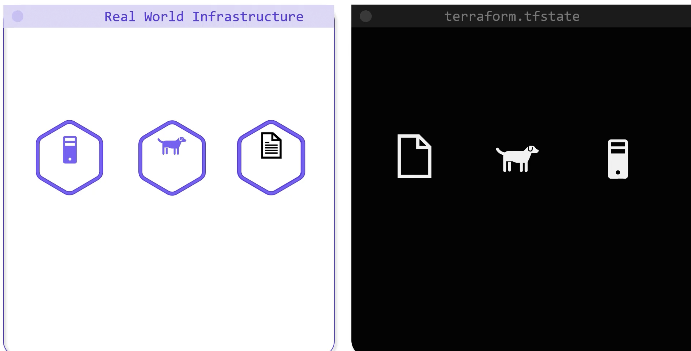

BENEFITS OF TERRAFORM

1. Managing Resource Dependencies:

Terraform supports two types of dependencies: implicit and explicit. Consider the following example configuration that provisions three resources:

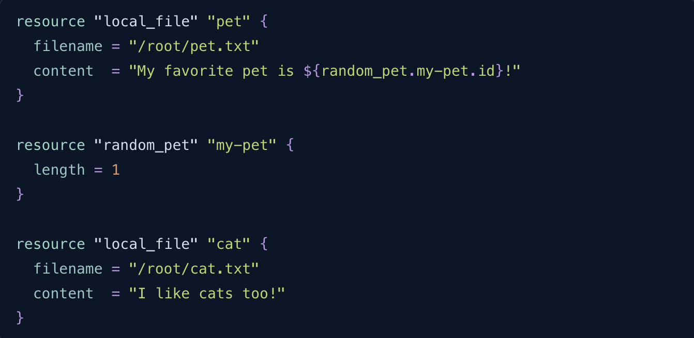

In the configuration above, the local_file.pet resource depends on the random_pet.my-pet resource through its content definition, while the local_file.cat resource is independent. When applying this configuration, Terraform creates the resources in the following order:

1. 'random_pet.my-pet' and 'local_file.cat' are created in parallel.
2. Once the above resources are successfully provisioned, Terraform creates the dependent local_file.pet resource.
The provisioning flow is illustrated in the output below:

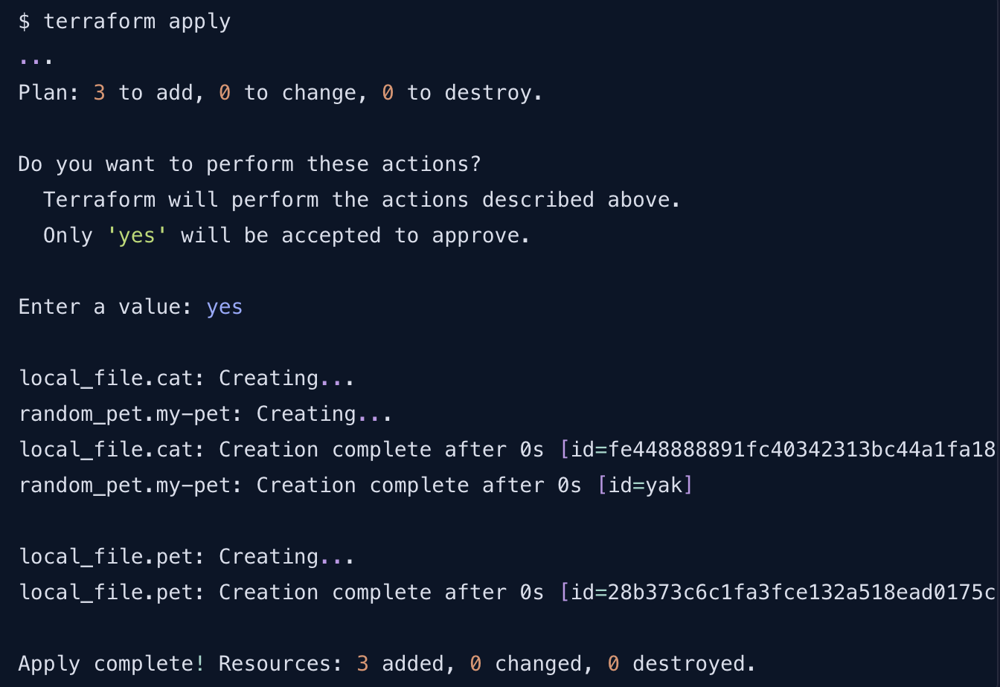

When resources are removed from a configuration, the state file plays a critical role by retaining dependency metadata. For example, even if the configuration no longer shows that local_file.pet depends on random_pet.my-pet, the state file ensures that Terraform deletes local_file.pet first, followed by random_pet.my-pet.

Below is an excerpt from a state file that shows the metadata for the local_file.pet resource:

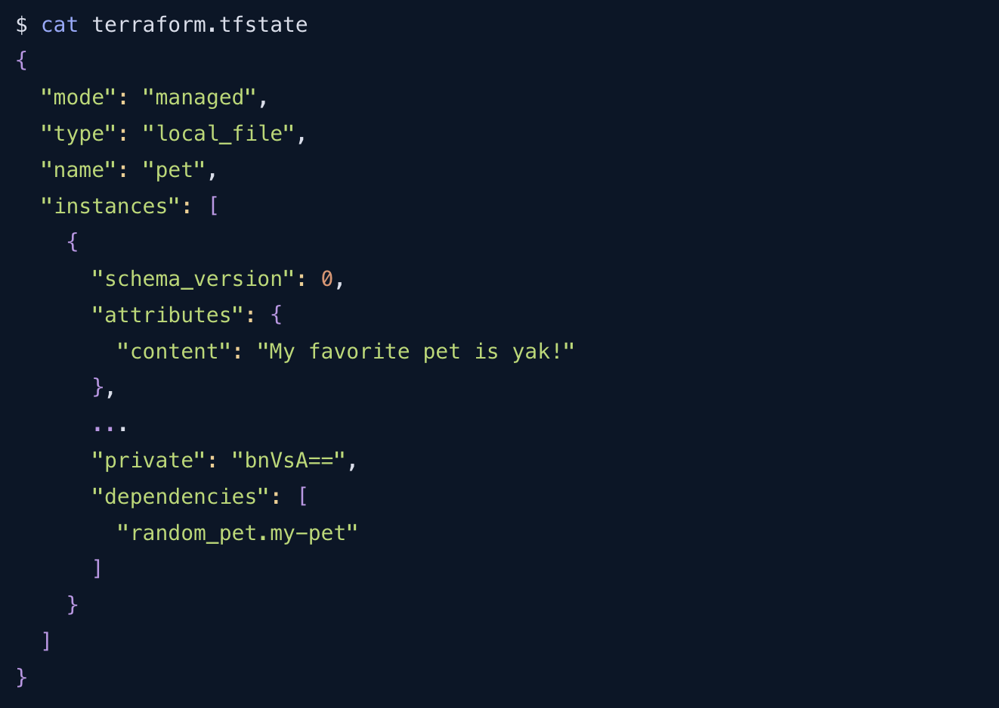

2. Performance Gains with State Caching:

For small infrastructures, Terraform actively reconciles state with the real infrastructure on every command, such as plan or apply. However, in production environments where you might manage hundreds or thousands of resources, constantly fetching the state from providers would lead to delays.

Terraform overcomes this challenge by caching resource attribute values in the state file. By running Terraform with the '-refresh=false' flag, you instruct it to rely on the cached state, thereby speeding up operations.

Consider the following JSON snippet representing a sample state:

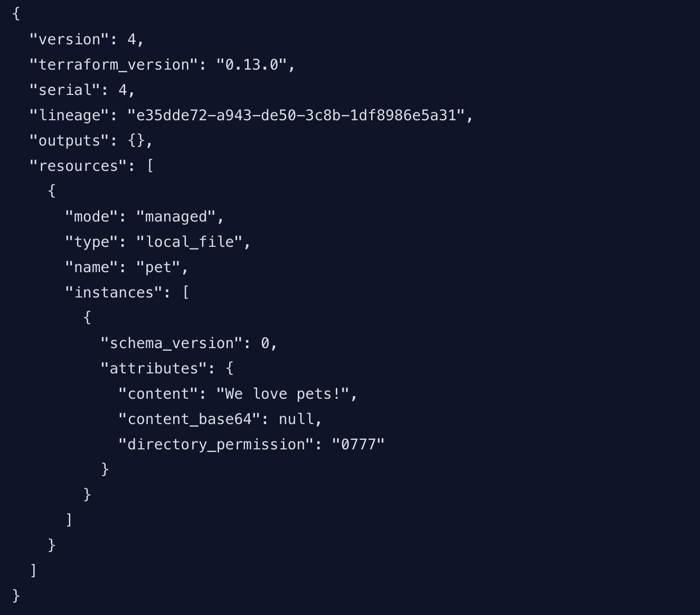

When running a plan with the cached state:

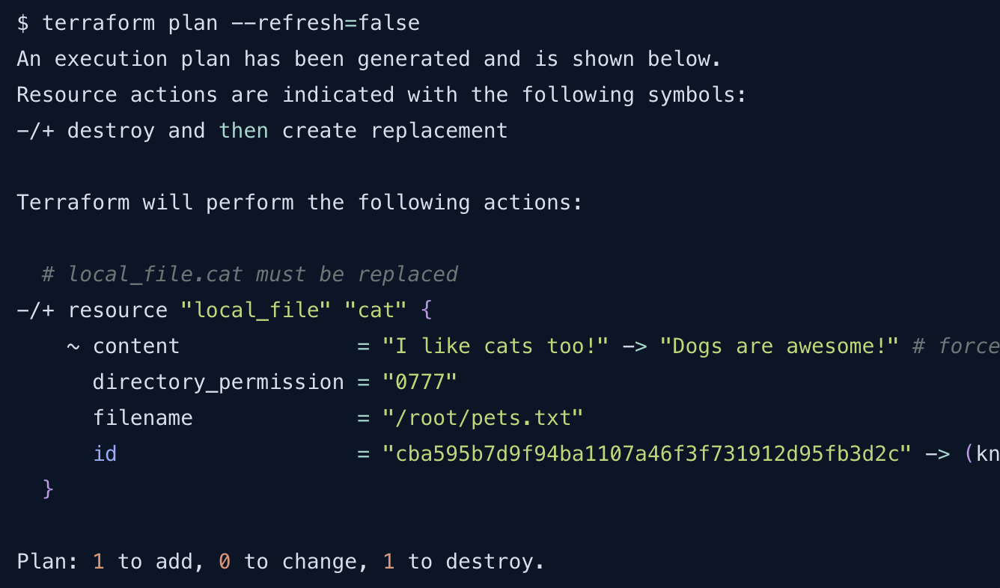

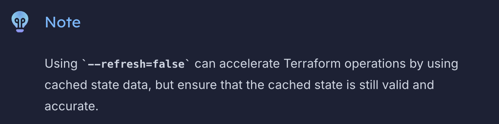

3. Enhancing Team Collaboration with Remote State Storage:

For individual projects, storing the terraform.tfstate file locally works well. However, in team environments, having an up-to-date and consistent state file is critical to avoid unpredictable errors. A remote backend—such as AWS S3, Terraform Cloud, or HashiCorp’s Console—ensures that every team member accesses the latest state.

A typical project directory might resemble the following:

Storing the state remotely prevents discrepancies and significantly enhances team collaboration.